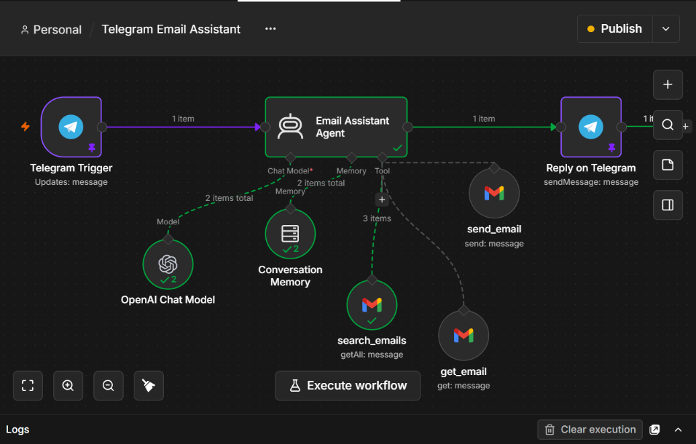
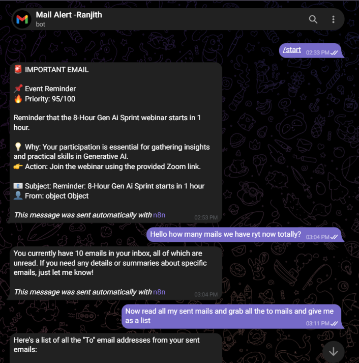
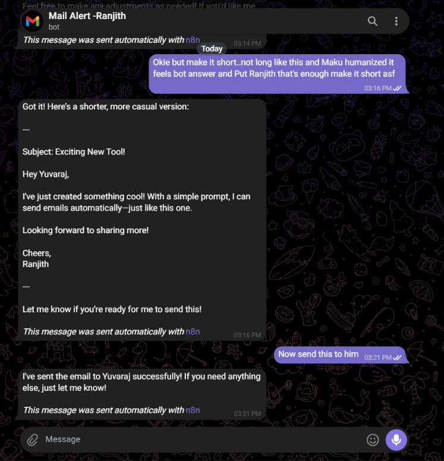

# Telegram Gmail AI Assistant

> **Talk to your Gmail from Telegram.** Search, read, understand, and send emails through a tool-using AI agent built in n8n.

<p align="center">
  
</p>

<p align="center">
  <strong>Telegram → AI Agent → Gmail Tools → Telegram</strong><br>
  A practical example of connecting an LLM to real-world tools instead of building another standalone chatbot.
</p>

---

## What I built

Most AI demos stop at **“ask a question → generate an answer.”**

This project goes one step further: the model can decide when it needs to interact with Gmail, use the appropriate tool, and return the result through Telegram.

From Telegram, I can ask the assistant to:

-  Search Gmail using natural-language requests
-  Read the full content of a specific email
-  Keep short-term conversation context within the chat
-  Send an email through Gmail when instructed
-  Return the result directly inside Telegram

The workflow also includes a confirmation step before sending an email unless the user has explicitly instructed the assistant to send it.

---

## See it working

### 01 — Search and interact with Gmail

<p align="center">
  
</p>

The Telegram interface is the front end. The AI agent interprets the request and decides which Gmail operation is required.

### 02 — Continue the conversation

<p align="center">
  
</p>

Because conversation memory is connected to the agent, the interaction can continue naturally instead of treating every Telegram message as an isolated request.

---

## How it works

```text
┌──────────────┐
│   Telegram   │
│    User      │
└──────┬───────┘
       │ message
       ▼
┌──────────────────────┐
│    Telegram Trigger  │
└──────────┬───────────┘
           ▼
┌────────────────────────────────┐
│          AI Agent              │
│                                │
│  OpenAI model + conversation   │
│  memory + tool selection       │
└───────┬─────────┬──────────────┘
        │         │
        │         ├──────────────► Gmail Search
        │         ├──────────────► Gmail Read
        │         └──────────────► Gmail Send
        │
        ▼
┌──────────────────────┐
│   Telegram Response  │
└──────────────────────┘
```

### The interesting part

The LLM is not being used only to write text. It is connected to tools and conversation memory, so it can determine **when to search, when to retrieve an email, and when an action such as sending is appropriate.**

That makes this closer to an **AI agent workflow** than a traditional chatbot.

---

## Tech stack

| Technology | Purpose |
|---|---|
| **n8n** | Workflow orchestration and agent/tool routing |
| **OpenAI GPT-4o-mini** | Natural-language reasoning |
| **Telegram Bot API** | User-facing conversational interface |
| **Gmail** | Search, read, and send email operations |
| **Conversation Memory** | Maintains recent context within a Telegram chat |

---

## Project structure

```text
telegram-gmail-ai-assistant/
├── README.md
├── workflow.png
├── working-sample01.png
├── working-sample02.png
├── workflow/
│   └── telegram-gmail-ai-assistant.json
└── docs/
    └── README.md
```

---

## Run it yourself

### 1. Create a Telegram bot

Create a bot with **BotFather** and connect the Telegram credential in n8n.

### 2. Connect Gmail

Configure a Gmail OAuth2 credential in n8n with the permissions required for searching, reading, and sending mail.

### 3. Configure OpenAI

Connect your own OpenAI credential and use `gpt-4o-mini` as the chat model.

### 4. Import the workflow

Import:

```text
workflow/telegram-gmail-ai-assistant.json
```

The repository version contains credential placeholders. Select your own credentials after importing it into n8n.

### 5. Start chatting

Open the Telegram bot and try requests such as:

```text
Find emails from the last 7 days about interviews.
```

```text
Read the latest email from this sender.
```

```text
Send an email to the recruiter with the subject "Interview Follow-up".
```

---

## Security

The exported workflow in this repository is sanitized for public use:

- No live API keys
- No Telegram bot tokens
- No OAuth access tokens
- No private email data
- Credential IDs are replaced with placeholders

**Use your own credentials when importing the workflow. Never commit secrets to GitHub.**

---

## Why I built it

I wanted to learn what happens when an AI model is given access to actual software tools.

The goal was not to make another chatbot. It was to build a small system where an LLM can **interpret a request, choose a tool, retrieve real information, maintain context, and perform an action.**

Building it also forced me to work through the less glamorous parts of AI engineering: API credentials, OAuth, workflow orchestration, tool configuration, error-prone integrations, and safely handling actions that affect real email.

---

## What's next

- Add a stronger approval flow for email-sending actions
- Add email classification and priority detection
- Add scheduled inbox summaries
- Add better error handling and execution logging
- Extend the assistant to other productivity tools

---

## Workflow

The complete sanitized n8n export is available here:

**[`workflow/telegram-gmail-ai-assistant.json`](workflow/telegram-gmail-ai-assistant.json)**

---

<p align="center">
  Built with n8n · Telegram · Gmail · OpenAI
</p>
